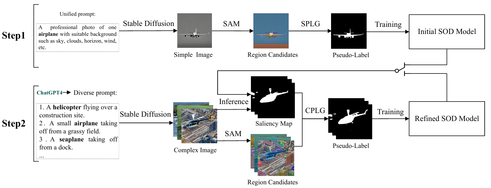
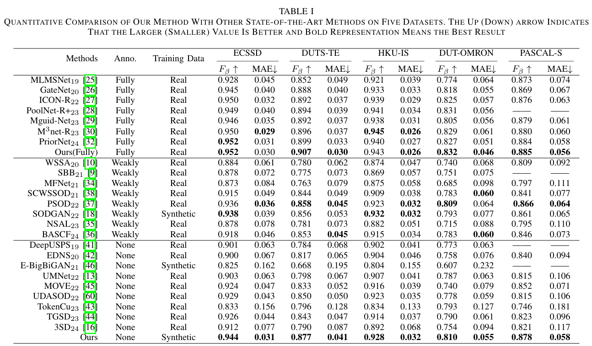
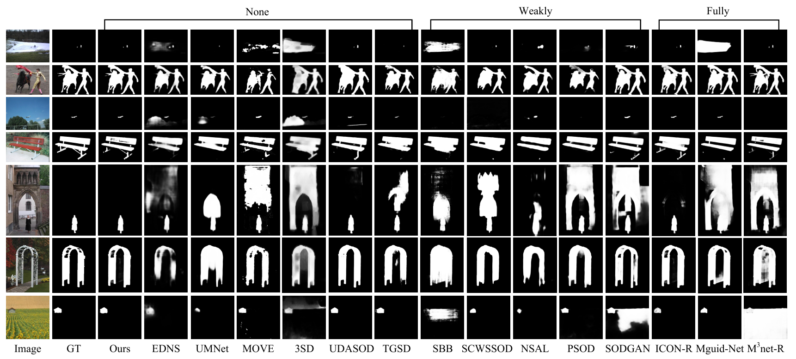

# Potential of Diffusion-Generated Data on Salient Object Detection

# 1. Resource
## eval dataset
* Download the ECSSD from [Here](https://www.cse.cuhk.edu.hk/leojia/projects/hsaliency/dataset.html)
* Download the DUTS-TR and DUTS-TE from [Here](http://saliencydetection.net/duts/#org3aad434).
* Download the HKU-IS from [Here](https://sites.google.com/site/ligb86/hkuis).
* Download the DUT-OMRON from [Here](http://saliencydetection.net/dut-omron/#org96c3bab)
* Download the PASCAL-S from [Baidu Drive](https://pan.baidu.com/s/1-CG3japmh1FrpZKjPFmTgQ?pwd=uf4t) [passeword: uf4t] or [Google Drive](https://drive.google.com/file/d/1MupxajLPXRack-GenraBEhSlKWeRs1M7/view?usp=drive_link)

## pre-trained
* Download the MoCo-v2 weight from [Here](https://github.com/facebookresearch/moco)
* Download the SAM vit_h weight from [Here](https://github.com/facebookresearch/segment-anything?tab=readme-ov-file#model-checkpoints)

## our result
The resources generated by our paper can be found at the 
[Baidu Drive](https://pan.baidu.com/s/12zkFm2kWvIsAoIE33l1U6w?pwd=9zd7) [passeword: 9zd7] or [Google Drive](https://drive.google.com/drive/folders/11VUV8SI6OLlMPadG9qHiu_Nuqd8o8Ru_?usp=drive_link), 
it includes:

1. the original synthetic data
2. the prompts generated by ChatGPT
3. the training data after we generated pseudo-labels
4. the weights of the model (also includes the weight trained under the DUTS-TR dataset)
5. the saliency maps


# 2. Main
After you download the data from the first step, please place it in the `dataset` directory as illustrated below.

```shell script
dataset:
    - SimpleImages
        - simple1
        - simple2
    - ComplexImages
        - image
    
    - ECSSD
    - ...
```
After preparing the data, you can directly run the `script.sh` script to generate pseudo-labels and train the network model simultaneously.
```shell script
bash script.sh
```
We also provide the `train_test.sh` script for single-run training and evaluation.
```shell script
bash script.sh maxsum res 2 dataset/DUTS-TR
```
# 3. Results





# 4. Acknowledgments
Our code was built upon [A2S-v2](https://github.com/moothes/A2S-v2.git), and we thank them for their excellent work.
